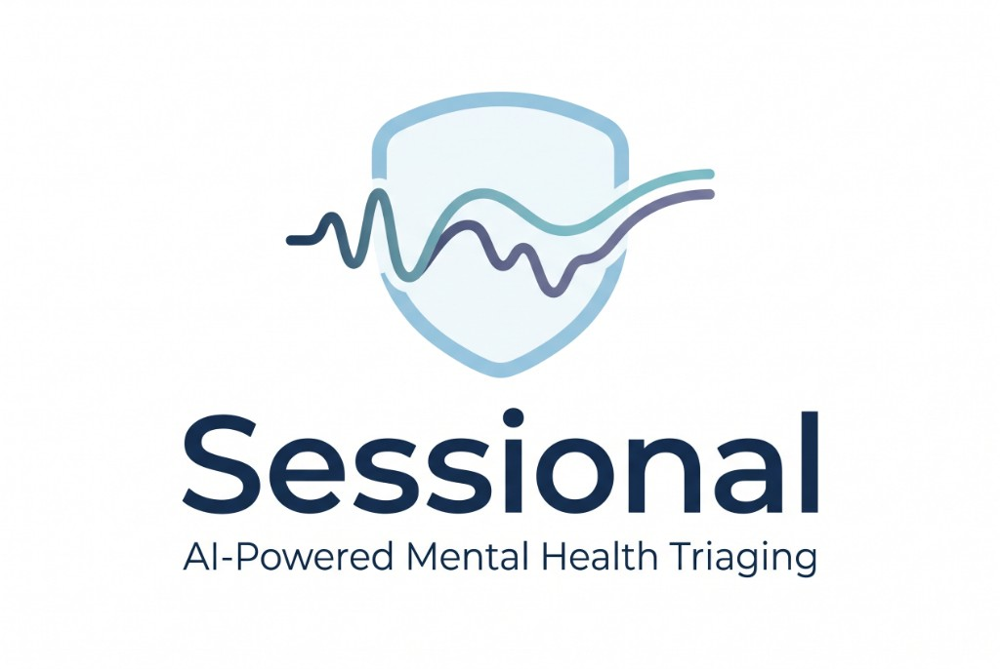
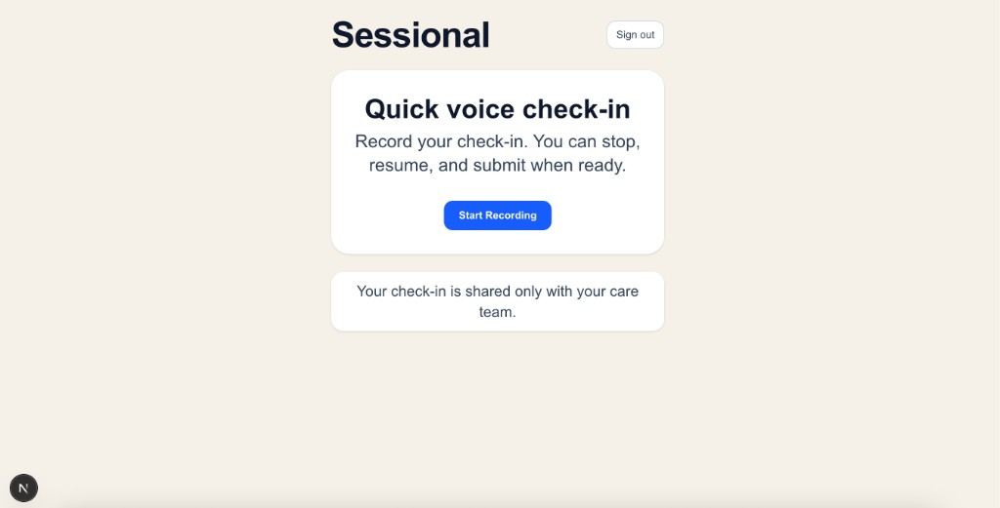
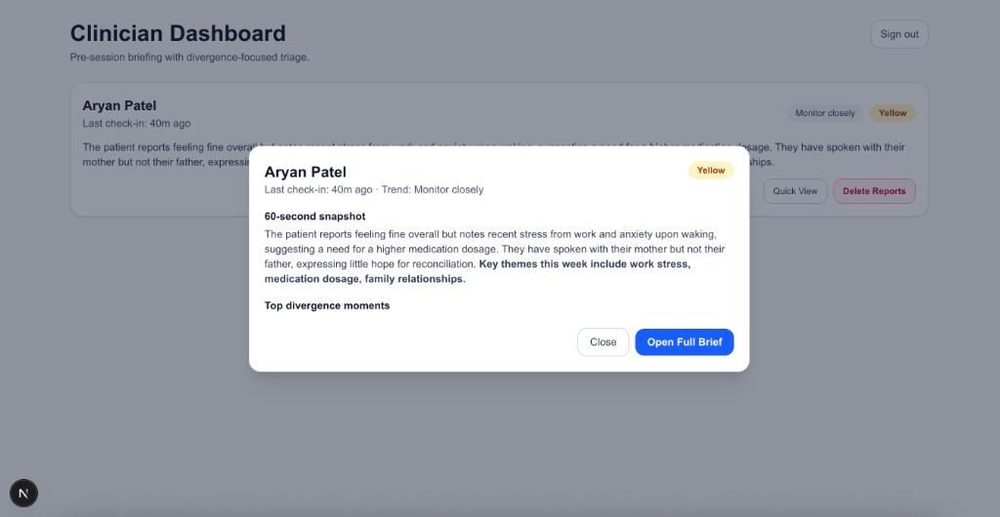
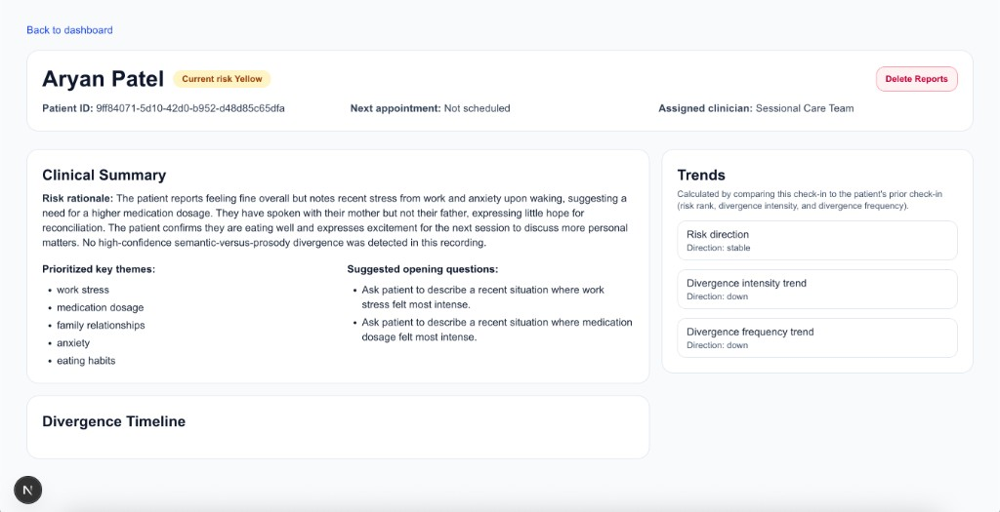
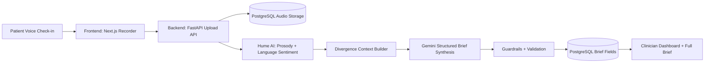

# Sessional 

Therapists often see patients once a week (or less), but emotional state can change every day. Between sessions, important signals get lost in text check-ins or never get shared at all. We built Sessional to close that gap: give patients a low-friction way to send voice updates, and give therapists a fast, structured view of what needs attention before the next session.

## Setup Guide

Complete local setup and run instructions live in `docs/setup.md`.
Tech stack details live in `docs/tech_stack.md`.

## Demo

- **Patient flow:** role selection -> patient auth -> record voice check-in -> submit
- **Clinician flow:** clinician auth -> dashboard quick view -> full brief with divergence timeline and trends

Demo screenshots:

## Architecture Diagram

## Product Context

- Patients complete short asynchronous voice check-ins.
- Check-ins are processed for both linguistic and vocal affective signals.
- Clinicians see concise triage-ready briefs with risk, themes, divergence moments, and trend signals.
- The core "divergence" concept highlights moments where spoken semantic sentiment appears neutral/positive while prosody indicates elevated distress.

## Architecture Overview

- **Monorepo layout**
  - `frontend/`: Next.js App Router clinician/patient web app
  - `backend/`: FastAPI APIs, auth, processing orchestration, persistence
  - `docs/`: setup and operational notes
- **Frontend**
  - Role-based landing flow and auth pages for patients and clinicians
  - Patient recorder flow: `start -> stop -> resume -> end -> submit`
  - Clinician dashboard quick-view modal + full brief page
- **Backend**
  - Email/password auth with JWT and role-based access checks
  - Audio ingestion and persistence in PostgreSQL (`audio_recordings.audio_data`)
  - Model pipeline: Hume extraction + Gemini synthesis
  - Brief post-validation guardrails to reduce hallucinations

## AI/Signal Pipeline

1. Patient uploads audio (`POST /api/v1/checkins/upload`).
2. Hume batch processing extracts utterance-level transcript, sentiment, timing, and top emotions.
3. Divergence context is computed using semantic sentiment vs negative-valence prosody.
4. Gemini generates structured brief JSON (`risk_level`, `summary`, `key_themes`, `divergence_moments`).
5. Guardrails repair/normalize unsupported snippets and enforce evidence grounding.
6. Clinician APIs expose latest patient brief and historical trend comparisons.

## Brief Semantics (Current)

- **60-second snapshot (`summary`)**: longer theme-focused narrative; excludes explicit divergence phrasing.
- **Clinical summary (`clinical_summary`)**: clinician-facing rationale with divergence count context.
- **Divergence timeline**: timestamped transcript snippets, mismatch interpretation, severity, confidence.
- **Trends**:
  - Risk direction from prior check-in (`Green < Yellow < Red`)
  - Divergence frequency trend from divergence-moment count delta
  - Divergence intensity trend from weighted severity-confidence delta

## Safety and Scope

- Sessional is a **clinical support and triage aid**, not a diagnostic system.
- Output summaries are evidence-grounded signals to support therapist preparation, not clinical conclusions.
- The app is **not** an emergency response service and should not be used as a crisis hotline replacement.
- Human clinician judgment is required for interpretation and care decisions.

## Main Routes

- `/` role chooser
- `/auth/patient` patient login/signup
- `/auth/clinician` clinician login/signup
- `/patient` patient check-in recorder
- `/clinician` clinician dashboard (real data)
- `/clinician/patients/[patientId]` full patient brief

## Core API Endpoints

- `POST /api/v1/auth/signup` (requires `full_name`, `email`, `password`, `role`)
- `POST /api/v1/auth/login`
- `GET /api/v1/auth/me`
- `POST /api/v1/checkins/upload` (patient-only)
- `GET /api/v1/checkins/storage/latest` (clinician-only)
- `GET /api/v1/checkins/storage/{recording_id}/download` (clinician-only)
- `GET /api/v1/briefs/patients` (clinician-only)
- `GET /api/v1/briefs/patients/{patient_id}` (clinician-only)
- `DELETE /api/v1/briefs/patients/{patient_id}/reports` (clinician-only)
